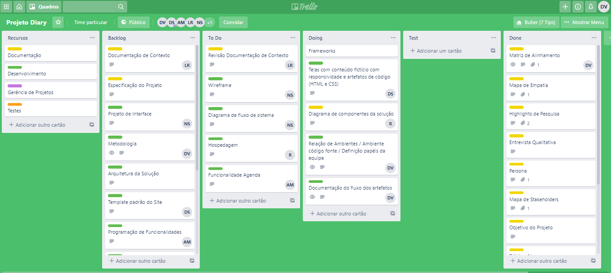
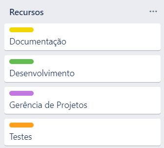

# Gerenciamento de Projeto

> A metodologia contempla as definições ferramentais que serão utilizados pela equipe tanto para a manutenção dos códigos e demais artefatos, quanto para a organização do time na execução das tarefas do projeto.

## Divisão de Papéis

A equipe está organizada da seguinte maneira:

- Scrum Master: Danielle Dias Vieira

- Equipe de Desenvolvimento: 
  Arthur Crossy Mendes; 
  Daniel Vitor de Oliveira Santos; 
  Danielle Dias Vieira; 
  Luiz Fernando Carneiro Rodrigues; 
  Natã Oliveira Sousa; 
  Rodolfo Sousa Lopes. 

- Equipe de Design: 
  Daniel Vitor de Oliveira Santos; 
  Natã Oliveira Sousa. 

## Processo

A equipe utiliza metodologias ágeis, tendo escolhido o Scrumban como base para definição do processo de desenvolvimento. Scrumban (termo cunhado pelo Corey Ladas em 2008), é uma metodologia de desenvolvimento Agile que é um híbrido de Scrum e Kanban. Usa a natureza prescritiva do Scrum para ser Ágil. Usa a melhoria de processo do Kanban para permitir que a equipe melhore continuamente seu processo.

Para organização e distribuição das tarefas do projeto, a equipe está utilizando o Trello estruturado com as seguintes listas:

- `Recursos`: Esta lista contém tarefas que são como legendas das cores de cada cartão e também serão utilizadas para cópia de tarefas, agilizando assim a criação de novos cartões.
- `Backlog`: Todos os artefatos identificados por todo o projeto. Representa o Product Backlog.
- `To Do`: Esta lista é o Sprint atual que estamos trabalhando.
- `Doing`: Quando uma tarefa tiver sido iniciada, ela é movida para esta lista.
- `Test`: Quando as tarefas são concluídas são movidas para esta lista, são testadas e é feito a revisão.`
- `Done`: Nesta lista são colocadas as tarefas concluídas, as que já foram revisadas e estão prontas para serem entregues para o cliente.

O quadro do Kanban do grupo está disponível no Trello, através da URL a seguir:

- Trello: https://trello.com/b/dn1hSkir/projeto-diary

A definição desta estrutura teve como referência a proposta feita por Andrew Littlefield em 2016.

Ela está representada, no estado atual, pela imagem abaixo:

As tarefas seguem o seguinte esquema de cores:
 
 

## Ferramentas

As ferramentas empregadas no projeto são:

- Editor de código.
- Ferramentas de comunicação
- Ferramentas de diagramação

O editor de código foi escolhido porque ele possui uma integração com o
sistema de versão. As ferramentas de comunicação utilizadas possuem
integração semelhante e por isso foram selecionadas. Por fim, para criar
diagramas utilizamos essa ferramenta por melhor captar as
necessidades da nossa solução.

> Liste quais ferramentas foram empregadas no desenvolvimento do
> projeto, justificando a escolha delas, sempre que possível.
>
> **Possíveis Ferramentas que auxiliarão no gerenciamento**:
>
> - 
> - 
>
> - 
> - 
